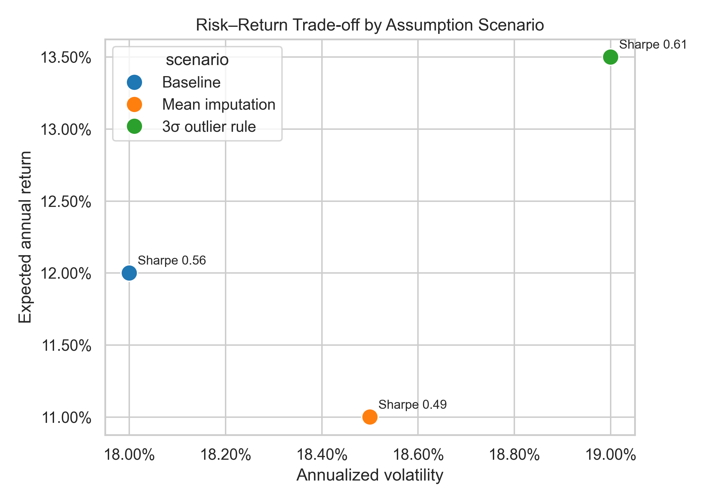
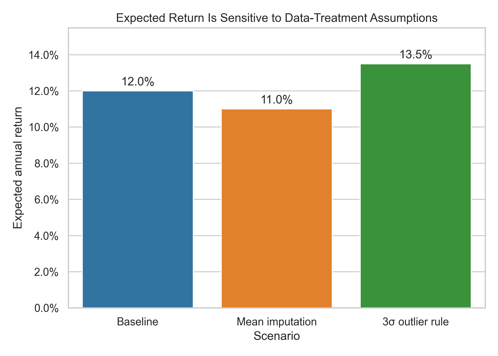
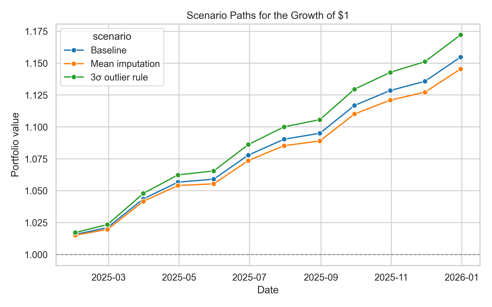

# Assumption-Sensitive Portfolio Outlook

**Audience:** Investment Committee  
**Decision:** Select a planning assumption and determine whether the analysis is ready for further validation.

## Executive summary

- **Use the baseline for planning:** expected annual return is 12.0% at 18.0% volatility, with an estimated Sharpe ratio of 0.56.
- **Treat the result as a range:** reasonable data-treatment assumptions move expected return between 11.0% and 13.5%.
- **Require validation before acting:** the highest-return 3σ scenario also has the highest volatility and may hide legitimate tail observations.

## Risk and return

The 3σ outlier scenario reports the strongest risk-adjusted result (13.5% return, 19.0% volatility, Sharpe 0.61). The baseline reports 12.0%, 18.0%, and 0.56. These are scenario inputs rather than realized investment performance; the chart shows the consequence of assumptions, not proof that a cleaning rule creates alpha.

## Sensitivity to data treatment

| Scenario | Expected return | Volatility | Sharpe | Change vs baseline |
|---|---:|---:|---:|---:|
| Baseline / median imputation | 12.0% | 18.0% | 0.56 | 0 bps |
| Mean imputation | 11.0% | 18.5% | 0.49 | -100 bps |
| 3σ outlier rule | 13.5% | 19.0% | 0.61 | +150 bps |

The 250-basis-point span between alternate scenarios is material. The committee should not receive 12.0% as a precise forecast without also seeing the 11.0%–13.5% sensitivity range.

## How differences compound

The common synthetic monthly pattern isolates the effect of scenario inputs. By year-end, the illustrated value of $1 ranges from roughly $1.15 to $1.17. This is useful for comparing assumptions, but it is not a backtest or a promise of future wealth.

## Assumptions and risks

- Expected returns and volatilities are scenario inputs. They are not forecasts with statistical confidence intervals.
- Sharpe ratios assume a constant 2% risk-free rate.
- All scenarios use the same synthetic monthly pattern so that only assumptions change.
- Fees, taxes, liquidity, estimation error, and extreme tail events are excluded.
- A 3σ rule can remove real crisis observations and understate downside risk; mean imputation can be distorted by skewness.

## What this means for you

Use the 12.0% baseline for budgeting while communicating 11.0%–13.5% as the assumption-driven range. Do not approve the strategy solely because the 3σ treatment produces the highest modeled return. Require an out-of-sample analysis that retains and separately reports tail events, then add fees and stress scenarios. Revisit the recommendation if realized volatility exceeds 19%, missingness becomes material, or the scenario ranking changes after costs.

## Reproducibility

Run `homework12_results-reporting-delivery-design_submission.ipynb` from top to bottom. It recreates `data/processed/final_results.csv`, the three figures in `reports/images/`, and `reports/sensitivity_summary.csv` using a fixed seed.
