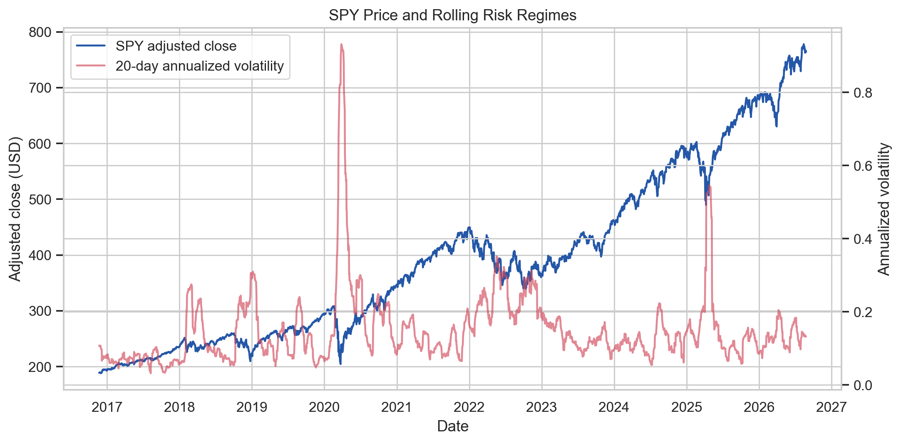
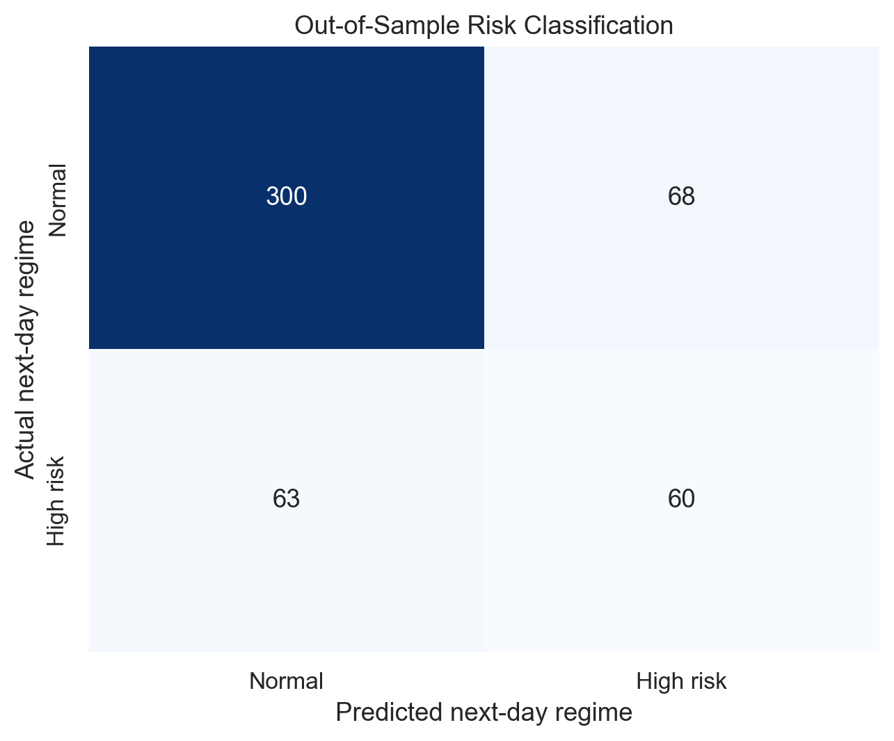
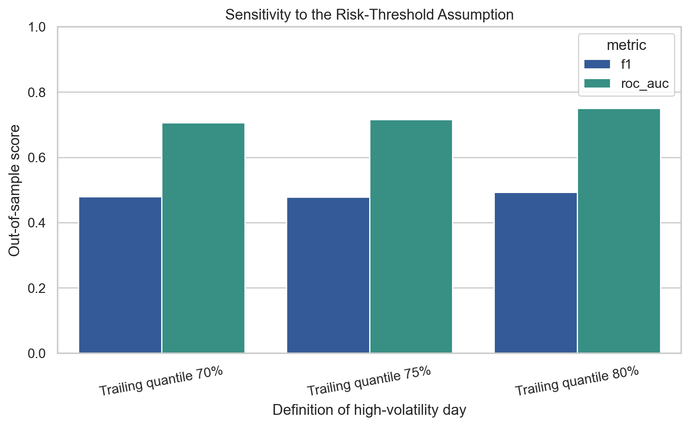
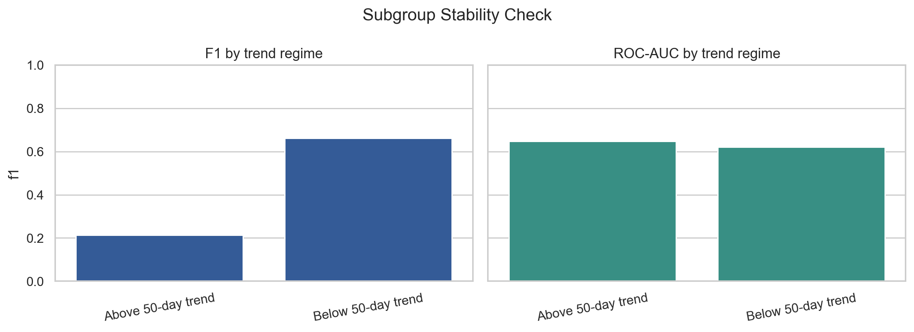
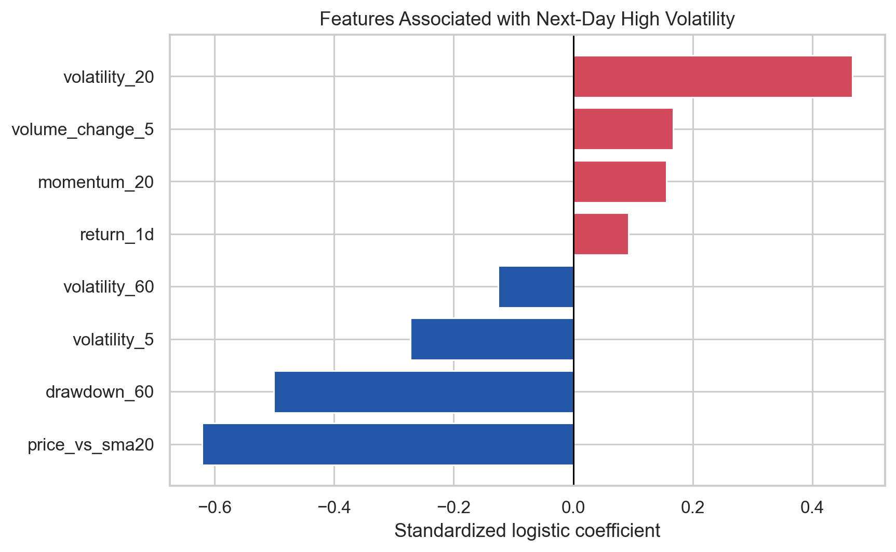

# SPY Next-Day High-Volatility Risk Monitor

**Audience:** Portfolio risk manager
**Data through:** 2026-08-25

## Executive summary

- The out-of-sample model achieves **ROC-AUC 0.716** and **F1 0.478** when identifying next-day high-volatility regimes.
- The bootstrap 95% interval for ROC-AUC is **[0.661, 0.768]**; this range should travel with the point estimate.
- Use the score as an escalation signal, not an automatic trading instruction. Review exposure when predicted probability exceeds 50%, especially when short- and medium-horizon volatility are both rising.

## Market context

The model uses only information available after the current session closes. Rolling volatility and drawdown summarize the risk regime; jumps are retained because deleting crisis observations would hide the events the monitor is designed to flag.

## Out-of-sample performance

Accuracy is **0.733**, precision **0.469**, and recall **0.488**. The majority-class accuracy baseline is **0.749**. A missed high-risk day is more costly than a false alert, so recall and probability calibration matter more than accuracy alone.

## Assumption sensitivity

| High-risk definition | Positive rate | F1 | ROC-AUC |
|---|---:|---:|---:|
| Trailing quantile 70% | 29.5% | 0.480 | 0.706 |
| Trailing quantile 75% | 25.1% | 0.478 | 0.716 |
| Trailing quantile 80% | 20.0% | 0.493 | 0.750 |

Changing the rolling threshold from the 70th to the 80th percentile changes both class balance and performance. The conclusion holds only if “high volatility” is defined consistently with the risk manager's escalation policy.

## Subgroup diagnostic

| Trend regime | Rows | Positive rate | F1 | ROC-AUC |
|---|---:|---:|---:|---:|
| Above 50-day trend | 381 | 18.4% | 0.214 | 0.648 |
| Below 50-day trend | 110 | 48.2% | 0.662 | 0.621 |

Performance differences across above- and below-trend periods reveal where aggregate metrics can conceal failure. Use the weaker regime's results when setting operational expectations.

## Feature interpretation

Coefficients describe conditional association after scaling; they do **not** establish causality. Highly correlated rolling-volatility features can redistribute coefficient weight without changing prediction quality.

## Assumptions and risks

- Historical SPY behavior is assumed to remain relevant; structural breaks can invalidate the relationship.
- Prices are end-of-day and the signal is not available before the close.
- The target is based on a trailing 252-session quantile, so its business meaning depends on that definition.
- Yahoo data availability, corporate-action adjustments, schema drift, and delayed labels can interrupt or distort the pipeline.
- The analysis excludes trading costs, taxes, liquidity, portfolio constraints, and the economic cost of false alerts.

## What this means for you

Use predicted probability as one input to a daily risk review. Escalate for human review above 50%; do not automatically trade. Monitor feature null rates, data freshness, alert frequency, rolling recall/AUC, and API latency. Retrain or pause the service if rolling ROC-AUC falls below 0.55, input nulls exceed 1%, or the daily file is more than one business day stale.
